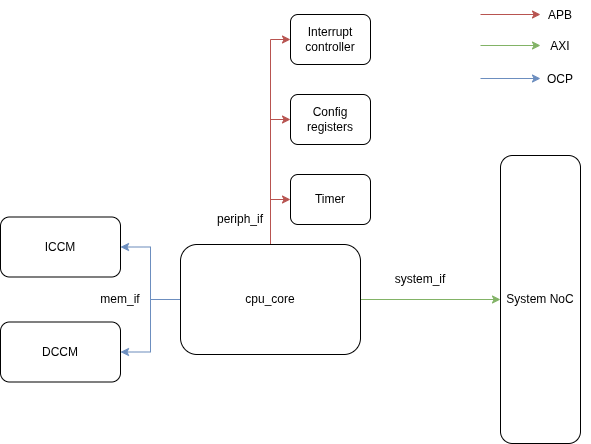

# CPU documentation

## Table of contents

1. [Registers](#registers)
2. [Exception table](#exception-table)
3. [Interfaces](#cpu-interfaces)

## Registers

| CSR Address | Name        | Privilege | Parameter | Description                               |
|-------------|-------------|-----------|-----------|-------------------------------------------|
| **Machine CSRs**                                                                  |
| 0x300       | `mstatus`   | MRW       |           | Machine Status.           |
| 0x305       | `mtvec`     | MRW       |           | Machine Trap-Handler Base Address         |
| ...         | ...         | ...       | ...       | ...                                       |
| 0x341       | `mepc`      | MRW       |           | Machine Exception Program Counter         |
| 0x342       | `mcause`    | MRW       |           | Machine Trap Cause                        |
| 0x343       | `mtval`     | MRW       |           | Machine Trap Value                        |

### Machine Status (`mstatus`)

**CSR Address:** 0x300  
**Reset Value:** 0x0000_1800

| Bit # | R/W | Description |
|-------|-----|-------------|
| 63:32 | R (0x0) | Hardwired to 0. |
| 31 | WARL (0x0) | **SD**. Hardwired to 0. |
| 30:23 | WPRI (0x0) | Reserved. Hardwired to 0. |
| 22 | WARL (0x0) | **TSR**. Hardwired to 0. |
| 21 | WARL | **TW**: Timeout Wait. When set, WFI executed from user mode causes an illegal exception. The time limit is set to 0 for CV32E40S. |
| 20 | WARL (0x0) | **TVM**. Hardwired to 0. |
| 19 | R (0x0) | **MXR**. Hardwired to 0. |
| 18 | R (0x0) | **SUM**. Hardwired to 0. |
| 17 | RW | **MPRV**: Modify Privilege. When MPRV=1, load and store memory addresses are translated and protected as though the current privilege mode were set to MPP. |
| 16:15 | R (0x0) | **XS**. Hardwired to 0. |
| 14:13 | WARL (0x0) | **FS**. Hardwired to 0. |
| 12:11 | WARL (0x0, 0x3) | **MPP**: Machine Previous Priviledge mode. Returns the previous privilege mode. When an mret is executed, the privilege mode is change to the value of MPP. |
| 10:9 | WPRI (0x0) | **VS**. Hardwired to 0. |
| 8 | WARL (0x0) | **SPP**. Hardwired to 0. |
| 7 | RW | **MPIE**. When an exception is encountered, MPIE will be set to MIE. When the `mret` instruction is executed, the value of MPIE will be stored to MIE. |

### Machine Trap-Vector Base Address (`mtvec`)

**When an exception or an interrupt is encountered, the core jumps to the corresponding handler using the content of the `mtvec[63:7]` as base address.**

**CSR Address:** 0x305  
**Reset Value:** Defined

| Bit # | R/W | Description |
|-------|-----|-------------|
| 63:7 | WARL | **BASE[63:7]**: Trap-handler base address, always aligned to 128 bytes. |
| 6:0 | WARL (0x0) | **BASE[6:0]**: Trap-handler base address, always aligned to 128 bytes. `mtvec[6:2]` is hardwired to 0x0. |

### Machine Exception PC (`mepc`)

**When an exception is encountered, the current program counter is saved in MEPC, and the core jumps to the exception address. When a mret instruction is executed, the value from MEPC replaces the current program counter.**

**CSR Address:** 0x341  
**Reset Value:** 0x0000_0000

| Bit # | R/W | Description |
|-------|-----|-------------|
| 63:1 | WARL | Machine Expection Program Counter 63:1 |
| 0 | WARL (0x0) | Hardwired to 0. |

### Machine Cause (`mcause`)

**When an exception is encountered, the corresponding error code is stored in this register.**

| Bit # | R/W | Description |
|-------|-----|-------------|
| 63:32 | R (0x0) | Hardwired to 0. |
| 31 | RW | **INTERRUPT**. This bit is set when the exception was triggered by an interrupt. |
| 30:11 | WLRL (0x0) | **EXCCODE[30:11]**. Hardwired to 0. |
| 10:0 | WLRL | **EXCCODE[10:0]**. Exception code, see Exception Table below. |

### Machine Trap Value (`mtval`)

**CSR Address:** 0x343  
**Reset Value:** 0x0000_0000

| Bit # | R/W | Description |
|-------|-----|-------------|
| 63:0 | WARL (0x0) | Hardwired to 0. |

## Exception Table

| Interrupt | Exception Code | Description |
|-----------|----------------|-------------|
| 0 | 1 | Instruction access fault |
| 0 | 2 | Illegal instruction |
| 0 | 3 | Breakpoint |
| 0 | 5 | Load access fault |
| 0 | 7 | Store/AMO access fault |
| 0 | 8 | Environment call from U-Mode (ECALL) |
| 0 | 11 | Environment call from M-Mode (ECALL) |
| 0 | 24 | Instruction bus fault |
| 0 | 25 | Instruction parity/checksum fault |

## CPU interfaces

Module `cpu_core` where all the execution logic is contained posseses three interfaces:

| interface name | start address | end address |
|----------------|------|--------|
| periph_if |  0x2_0000    |  0x2_2FFF   |
| mem_if |  0x0x8000_0000    |  0x8FFF_FFFF   |
| system_if |  0x1_0000_0000    |  0x1_FFFF_FFFF   |
